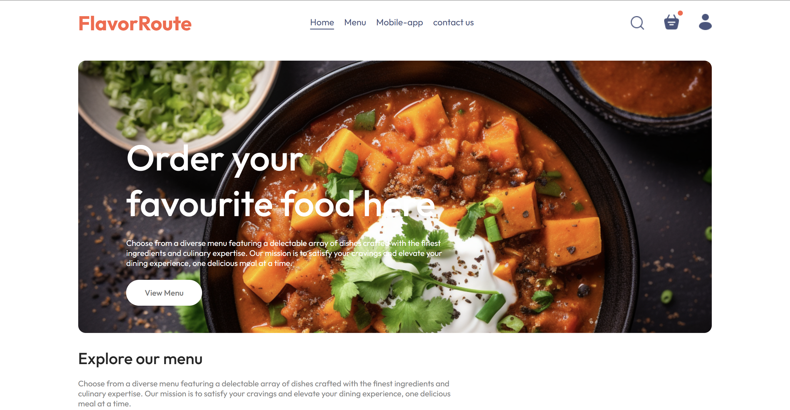

# 🍽️ FlavorRoute

FlavorRoute is a full-stack food delivery web application built using the MERN (MongoDB, Express.js, React.js, Node.js) stack. The platform allows users to browse, order, and pay for food online seamlessly.

## 🚀 Features

- 🔐 User authentication (Signup/Login)
- 🛒 Add items to the cart and place orders
- 💳 Secure online payments
- 📦 Order tracking
- 🛠️ Admin dashboard for managing orders and products

## 🛠️ Tech Stack

- Frontend: React.js
- Backend: Node.js, Express.js
- Database: MongoDB (Mongoose)
- Authentication: JSON Web Tokens (JWT)
- Payment Integration: Stripe
- Deployment: Netlify (Frontend), Render (Backend)

## 📌 Installation & Setup

### Prerequisites
Ensure you have the following installed:
- 📌 Node.js (v16+)
- 📌 MongoDB (Local or Atlas)

## 🚀 Deployment
- **Frontend:** Hosted on [Netlify](https://flavor-route.netlify.app)
- **Backend:** Hosted on Render

## 📸 Screenshots

### 🏠 Home Page

## 🎯 Usage
1. 🔑 Register/Login as a user.
2. 🍕 Browse food items and add them to your cart.
3. 💵 Proceed to checkout and complete the payment.
4. 🚚 Track your order status.
